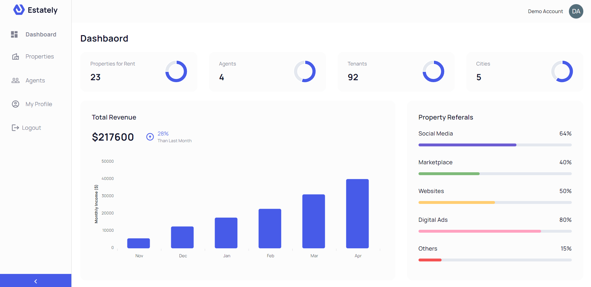
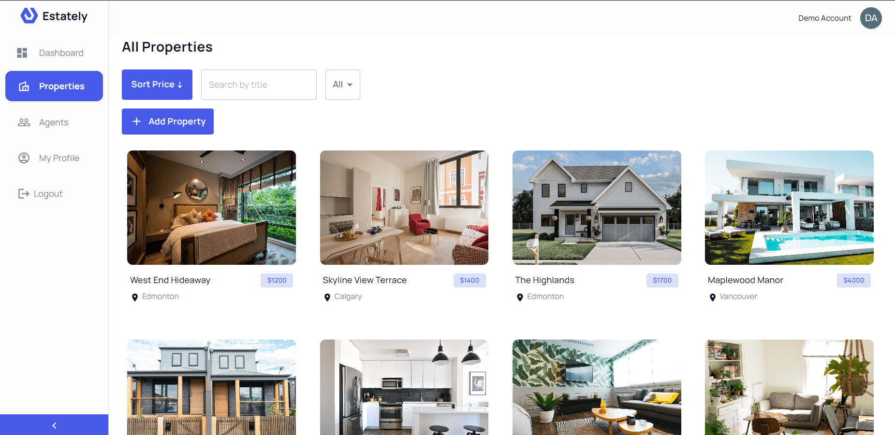
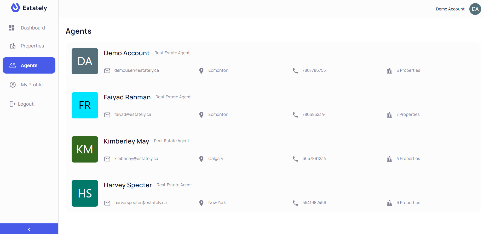
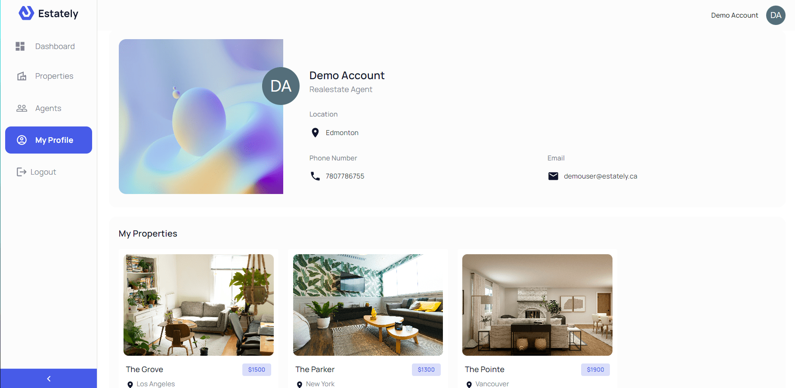

## Estately

### Live Demo: https://estately.onrender.com

A web application that allows users to manage their real estate portfolio/company, track earnings over time, and visualize the data for informed decision-making.

Built with MongoDB, Express.js, React, Node.js, Refine, Typescript, and Javascript.

## Project Screen Shot(s)







## Project Status
This project is currently in development. Almost all major functionality is complete. Users can manage their properties and agents, and track their earnings. 

Features currently in progress:
* Scheduling meetings with other agents
* Calling and emailing other agents directly within the app
* More detailed expense tracking for each property
* Third-party authentication

## Installation and Setup Instructions

Clone down this repository. You will need `node` and `npm` installed globally on your machine.  

#### Client Installation:

```bash
    npm install
```

##### Running the development server.

```bash
    npm run dev
```

##### Building for production.

```bash
    npm run build
```

##### Running the production server.

```bash
    npm run start
````  

#### Server Installation:
You will need to have a MongoDB Atlas database setup and a Cloudinary account
```bash
    npm install
```

##### Adding environment variables
create a .env file and add the following fields:
```
DATABASE_URI= [your MongoDB database url]
CLOUDINARY_URL= [your cloudinary url]
CLOUDINARY_API_SECRET= [your cloudinary api secret]
CLOUDINARY_NAME= [your cloudinary name]
CLOUDINARY_API_KEY= [your cloudinary api key]
ACCESS_TOKEN_SECRET= [secure random secret]
REFRESH_TOKEN_SECRET= [secure random secret]
```

##### Running the server.

```bash
    npm start
```


## Reflection

This was a 3 week long side project built during my winter 2023 semester at the University of Alberta. Project goals included learning the React Refine framework and Typescript, while strengthening my skills in React, and backend server development. 

I have always been interested in real-estate and thus wanted to build an application to track a real-estate portfolio. I wanted to build a way to manage your properties and visualize the income/expense data comprehensively. I started this process by using the `Refine` framework and `MUI` to build the frontend and my own Node and Express server for the backend. I deployed the app on Render.com.

One of the main challenges I ran into was Authentication. This lead me to spend a few days on a research spike into OAuth, Auth0, and two-factor authentication using Firebase or other third parties. Due to project time constraints, I had to table third-party authentication and focus on a custom authentication process with JWT. Adding more login methods (ie. Google) is definitely on the agenda.

Another complexity was the business logic for aggreagting data for the visualizing process as this was my first time doing data processing. My solution was to break down each problem into smaller, manageable subproblems and tackle them individually. This approach made it easier to focus on one specific aspect of the problem at a time, reducing the overall complexity

At the end of the day, the technologies implemented in this project are React, React-Router, Refine, MUI, Typescript, and Apexcharts for the frontend and MongoDB, Express, Node, and JWT for the backend. I chose to use Refine to minimize initial setup and invest more time in diving into weird technological rabbit holes. In the next iteration I plan on starting my frontend from scratch to more fully understand the process.